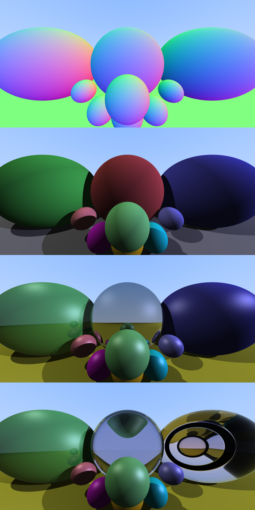

# Graphic Ray-tracing Demo

A simple hand-written application demonstrating basic ray-tracing using C++.




☝️ A collage of rendered outputs using [./make_collage.sh](./make_collage.sh)

## Prerequisites

Before building the project, ensure you have the following installed:

### Windows
- Visual Studio 2019 or later with C++ development tools
- [CMake](https://cmake.org/download/) (3.10 or higher)

### macOS
Using Homebrew:
```bash
brew install cmake
brew install glfw
brew install glew
```

### Linux (Ubuntu/Debian)
```bash
sudo apt-get update
sudo apt-get install cmake
```

## Building the Project

Generate build files:
```bash
cmake -S . -B build -DCMAKE_BUILD_TYPE=Release && cmake --build build
```

## Running the Examples

The project includes one example:

1. Ray Casting (Ray):
```bash
./build/bin/ray
```

## Controls

- Press `Control + C` or `Ctrl + Z` to interrupt the program

## Troubleshooting

### Windows
- Ensure all dependencies are properly installed and findable by CMake
- Add vcpkg toolchain file to CMake if using vcpkg: `-DCMAKE_TOOLCHAIN_FILE=[vcpkg root]/scripts/buildsystems/vcpkg.cmake`

### Linux

### macOS

## Features

This ray tracer supports:

*   **Geometry:** Renders scenes with multiple spheres.
*   **Ray Tracing:**
    *   Recursive tracing for reflections and refractions (Snell's Law).
    *   Configurable maximum recursion depth (default: 5).
*   **Materials:** Customizable properties including:
    *   Albedo (base color)
    *   Diffuse and specular coefficients
    *   Shininess
    *   Reflectivity and transparency
    *   Refractive index
*   **Lighting & Shading:**
    *   Multiple point lights with configurable attenuation.
    *   Hard shadow calculation.
    *   Phong-like shading (ambient, diffuse, specular).
*   **Image Quality:**
    *   Anti-aliasing via stochastic supersampling (64 samples/pixel).
    *   Fresnel effect (Schlick's approximation) for realistic transparency.
    *   Shadow acne prevention.
*   **Output:** Generates `.ppm` image files.

The program produces four example images:
1.  `1_multisphere.ppm`: Multi-sphere scene.
2.  `2_shadow.ppm`: Scene with shadows.
3.  `3_reflection.ppm`: Scene with reflections.
4.  `4_transmission.ppm`: Scene with transparency and refraction.
